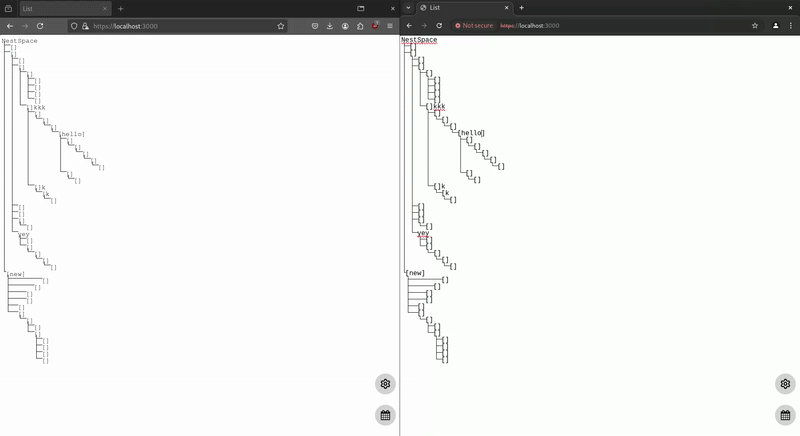

== Technologies used

- Rust backend, with Rocket framework for quick implementation
- Vanilla JS web components with shadow DOM tree
- Websocket for real-time update
- Caddy server for TLS encryption (originally implemented in rust backend)

== Thoughts going into the project

- Just wanted to whip out something really quick
- Wanted something that can show the tree structure of tasks and subtasks clearly, with deep nesting layers
- Also try out web components for the first time, instead of React

== Deployment and current status

- Deployed in a synology NAS with docker
- Actually used by the team for a few weeks
- Switched to an open-source kanban [WeKan](https://wekan.github.io/)
- Also added LDAP to stuff hosted on the NAS
- Currently, the project is not usable as a frontend-rewrite towards the end of its lifespan makes it buggy

== Reflections

- A fun project that lead to further explorations into web components such as [lit](https://lit.dev/) and [htmx](https://htmx.org/)
- A deeper understanding of the state of frontend frameworks
  - I was dissatisfied with the state of npm packaging a lot of packages and React being a bit tedious
  - Understand the new wave of frameworks (webc, htmx, etc.) in response to React/Vue (which themselves were responses to JQuery)
- First time deploying projects, learned basic networking
- This project was also before I joined my first internship, and looking back at my code I now see how unmaintainable it is; that internship taught me to think not only how to make the code work but how to make it work in a way that makes future people viewing / editing my code easier
